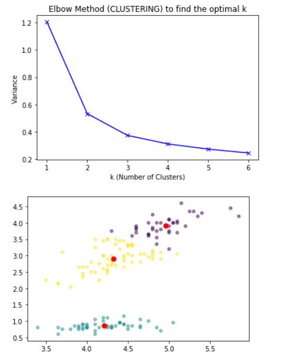

# ACM Research Coding Challenge (Fall 2020)
1. By: Gowtham Santhakumar
2. NetID: GXS180007
## Submission:
1. main.py

## Output:
 

## Sources

1. https://pythonprogramminglanguage.com/kmeans-elbow-method/
2. https://datatofish.com/k-means-clustering-python/
3. wikipedia.com

## No Collaboration Policy

**You may not collaborate with anyone on this challenge.** You _are_ allowed to use Internet documentation. If you _do_ use existing code (either from Github, Stack Overflow, or other sources), **please cite your sources in the README**.

## Question One

 
Given the following dataset in `ClusterPlot.csv`, determine the number of clusters by using any clustering algorithm. **You're allowed to use any Python library you want to implement this**, just document which ones you used in this README file. Try to complete this as soon as possible.

Regardless if you can or cannot answer the question, provide a short explanation of how you got your solution or how you think it can be solved in your README.md file.
